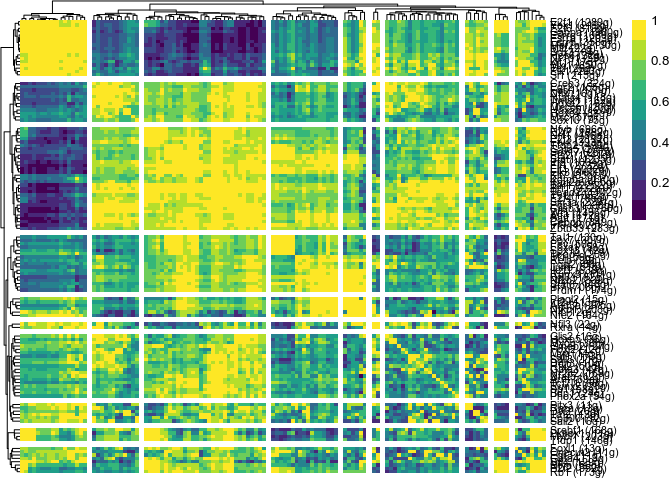
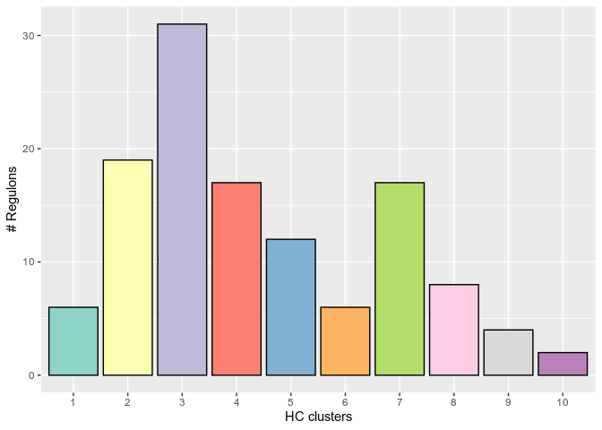
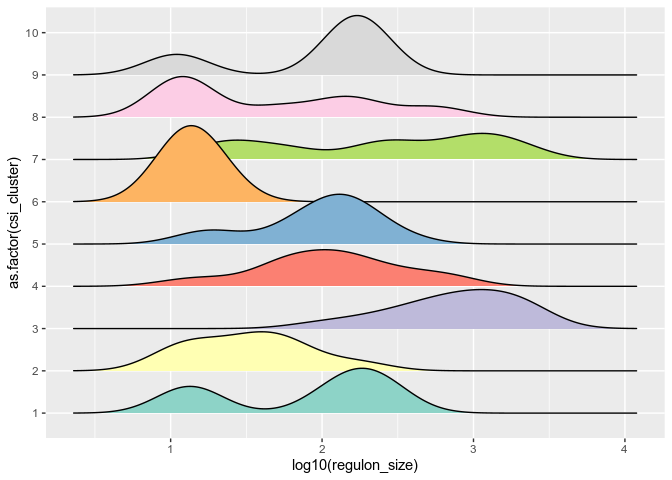
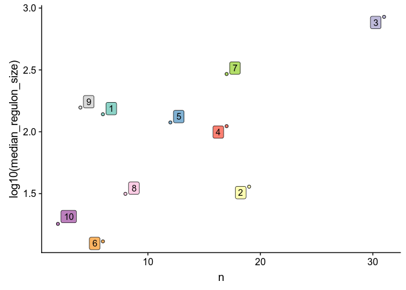

Processing and visualization of SCENIC results
================
Florian Wuennemann


# Introduction

This tutorial will describe how to use the functions implemented in this
package to further process the output from a typical run of the [SCENIC
pipeline](https://github.com/aertslab/SCENIC). This tutorial assumes
that you have processed your data up until the third step of the
pipeline. The following data will be required for completely running
this tutorial:

  - **regulonAUC** - The regulon activity scores in matrix format
    (output from file 3.4\_regulonAUC.Rds)
  - **cell classifications for your cell** - For example using a
    metadata data frame from a seurat object

We provide a small test data set as part of this package, which can be
found in ./example\_data to help test the scripts and analysis and get
familiar with the different data formats and plots. The example\_data is
from [Wuennemann et
al.](http://andelfingerlab.heart_maturation.genap.ca/) and represents
the AUC values for heart cells from E14.5 embryonic hearts.

If any of the defintions or terms in this tutorial are unclear, please
visit the SCENIC FAQ page and see whether your question is answered
there already:

[SCENIC
FAQ](https://github.com/aertslab/SCENIC/blob/master/vignettes/FAQ.md)

# Installation

You can easily install the package with the following command:

    library(devtools)
    install_github("FloWuenne/scFunctions")

# Regulon analysis

Many of the analysis concepts and statistics that are calculated in this
tutorial have been derived from a publication by [Suo et al. (2018) in
Cell
Reports](https://www.cell.com/cell-reports/fulltext/S2211-1247\(18\)31634-6?_returnURL=https%3A%2F%2Flinkinghub.elsevier.com%2Fretrieve%2Fpii%2FS2211124718316346%3Fshowall%3Dtrue).
In their publication, they used a modified version of SCENIC to call
regulons for the [Mouse Cell Atlas dataset](http://bis.zju.edu.cn/MCA/).

## Determine AUC thresholds

In the original implemntation of SCENIC, the authors included a function
to determine thresholds for the AUC activity via the function:
AUCell\_exploreThresholds(). In this package, we wrote a very simple
function that determines thresholds based on k-means clustering on the
AUC distribution. This function performs comparable to the original
implementation but is much faster. Please keep in mind however, that
this function might not perform very well for setting thresholds for
non-bimodal distribution, which are quite often observed for regulons.
We still advise to manually check and adjust the thresholds prior to
binarization of regulons\!

Let us use the regulons AUC values to determine thresholds using our
k-means function.

``` r
regulonAUC <- readRDS("../example_data/regulonAUC_subset.Rds")
kmeans_thresholds <- auc_thresh_kmeans(regulonAUC)
```

    ## Loading required package: SCENIC

    ## Registered S3 method overwritten by 'R.oo':
    ##   method        from       
    ##   throw.default R.methodsS3

    ## Loading required package: svMisc

    ## 
    ## Attaching package: 'svMisc'

    ## The following object is masked from 'package:utils':
    ## 
    ##     ?

    ## [1] "Processing regulon distributions..."
    ## Progress:   1%
    ## Progress:   100%
    ## [1] "Done evaluating thresholds..."

The thresholds are saved in list format where each regulon is the name
of the list and the AUC threshold is the value of the list.

``` r
head(kmeans_thresholds)
```

    ## $`Ybx1_extended (738g)`
    ## [1] 0.2018032
    ## 
    ## $`Ybx1 (219g)`
    ## [1] 0.07257359
    ## 
    ## $`E2f1_extended (1350g)`
    ## [1] 0.1336872
    ## 
    ## $`E2f1 (1289g)`
    ## [1] 0.1264914
    ## 
    ## $`Srebf2_extended (1404g)`
    ## [1] 0.1285305
    ## 
    ## $`Gabpa_extended (2442g)`
    ## [1] 0.2076677

While we use a sample k-means clustering approache with 2 clusters here
to determine thresholds, there are obviously more sophisticated
approaches than this to determine thresholds in the AUC distribution.
Feel free to develop your own approaches to determine optimal thresholds
to binarize regulons. I would be excited to hear back if you developed
your own function to perform this task\!

## Binarize regulons using thresholds

Now that we have our thresholds, it is time to binarize the regulons
using these
    thresholds.

``` r
binary_regulons <- binarize_regulons(regulonAUC,kmeans_thresholds)
```

    ## Progress:   1%  
    ## Progress: 100%

Let’s take a look at the first regulon in the binary regulon list.

``` r
head(binary_regulons$`Ybx1_extended (738g)`)
```

    ##                   cells Ybx1_extended (738g)
    ## 1 E14.5_r1_TTCTGACGATCT                    1
    ## 2 E14.5_r1_CACAAGACGTTC                    1
    ## 3 E14.5_r1_ACTGGCGATTAT                    1
    ## 4 E14.5_r1_CAATAAGTGAGN                    1
    ## 5 E14.5_r1_ACAGGTCGACGC                    1
    ## 6 E14.5_r1_GATTTCCATACC                    1

Next, we have to reformat the binary regulons into a big data frame that
contains all of the binary regulons so that we can use them to calculate
RRS scores.

``` r
library(tidyverse)

joined_bin_reg <- binary_regulons %>%
    reduce(left_join,by="cells")

rownames(joined_bin_reg) <- joined_bin_reg$cells
joined_bin_reg <- joined_bin_reg[2:ncol(joined_bin_reg)]

binary_regulons_trans <- as.matrix(t(joined_bin_reg))
```

Let’s check that the data table is formatted correctly before
proceeding:

``` r
binary_regulons_trans[1:4,1:3]
```

    ##                       E14.5_r1_TTCTGACGATCT E14.5_r1_CACAAGACGTTC
    ## Ybx1_extended (738g)                      1                     1
    ## Ybx1 (219g)                               0                     1
    ## E2f1_extended (1350g)                     1                     1
    ## E2f1 (1289g)                              1                     1
    ##                       E14.5_r1_ACTGGCGATTAT
    ## Ybx1_extended (738g)                      1
    ## Ybx1 (219g)                               1
    ## E2f1_extended (1350g)                     1
    ## E2f1 (1289g)                              1

## Calculate Regulon Specificity Score (RSS)

We now want to use the binary regulon activity together with the cell
assignments to see how specific each predicted regulon is for each cell
type. We can do this by calculating a regulon specificity score (RSS)
which is based on the Jensen-Shannon divergence, a measure of the
similarity between two probability distributions. Basically for the
calculation of the RSS, we will calculate the Jensen-Shannon divergence
between each vector of binary regulon activity overlaps with the
assignment of cells to a specific cell type.

First, we need to load the cell assignments as a data frame. This data
frame needs to have cell names that correspond with the binary regulon
data frame as rownames and contain a column labeled “cell\_type”, which
contains the assignments for all cells. For convenience, you can use the
metadata table from a correspondin Seurat object, just make sure that
you add a column labeled
    “cell\_type”.

``` r
metadata_sub <- readRDS("../example_data/metadata_sub.Rds")
```

``` r
head(metadata_sub)
```

    ##                       orig.ident nCount_RNA nFeature_RNA Mouse_ID   Age
    ## E14.5_r1_TTCTGACGATCT      E14.5      10497         3394       M1 E14.5
    ## E14.5_r1_CACAAGACGTTC      E14.5       9826         3342       M1 E14.5
    ## E14.5_r1_ACTGGCGATTAT      E14.5      10221         3266       M1 E14.5
    ## E14.5_r1_CAATAAGTGAGN      E14.5       9258         3450       M1 E14.5
    ## E14.5_r1_ACAGGTCGACGC      E14.5      10885         3579       M1 E14.5
    ## E14.5_r1_GATTTCCATACC      E14.5      10459         3578       M1 E14.5
    ##                       Replicate Litter Illumina_flowcell Sex
    ## E14.5_r1_TTCTGACGATCT        r1     L1         HLLVHBGXY   M
    ## E14.5_r1_CACAAGACGTTC        r1     L1         HLLVHBGXY   M
    ## E14.5_r1_ACTGGCGATTAT        r1     L1         HLLVHBGXY   M
    ## E14.5_r1_CAATAAGTGAGN        r1     L1         HLLVHBGXY   M
    ## E14.5_r1_ACAGGTCGACGC        r1     L1         HLLVHBGXY   M
    ## E14.5_r1_GATTTCCATACC        r1     L1         HLLVHBGXY   M
    ##                       doublet_scores_scrublet predicted_doublet_scrublet
    ## E14.5_r1_TTCTGACGATCT              0.02802721                      FALSE
    ## E14.5_r1_CACAAGACGTTC              0.03094556                      FALSE
    ## E14.5_r1_ACTGGCGATTAT              0.02165544                      FALSE
    ## E14.5_r1_CAATAAGTGAGN              0.04369102                      FALSE
    ## E14.5_r1_ACAGGTCGACGC              0.03033740                      FALSE
    ## E14.5_r1_GATTTCCATACC              0.02253797                      FALSE
    ##                       percent.mito    S.Score  G2M.Score Phase nCount_SCT
    ## E14.5_r1_TTCTGACGATCT   0.02438792 -0.6667862 -1.3860525    G1       2530
    ## E14.5_r1_CACAAGACGTTC   0.01465500 -0.4816747 -0.7297447    G1       2458
    ## E14.5_r1_ACTGGCGATTAT   0.03238431 -0.4856854 -1.2957825    G1       2502
    ## E14.5_r1_CAATAAGTGAGN   0.03262044  0.2346583  2.3575657   G2M       2464
    ## E14.5_r1_ACAGGTCGACGC   0.02406982 -0.7266369 -1.2373289    G1       2497
    ## E14.5_r1_GATTTCCATACC   0.01960034 -0.2892592 -1.3102109    G1       2455
    ##                       nFeature_SCT SCT_snn_res.0.8 cell_type
    ## E14.5_r1_TTCTGACGATCT         1345               7      ACM1
    ## E14.5_r1_CACAAGACGTTC         1356               7      ACM1
    ## E14.5_r1_ACTGGCGATTAT         1258               7      ACM1
    ## E14.5_r1_CAATAAGTGAGN         1429               7      ACM1
    ## E14.5_r1_ACAGGTCGACGC         1402               4      VCM1
    ## E14.5_r1_GATTTCCATACC         1352               4      VCM1
    ##                       clustering_lvl2 super_group
    ## E14.5_r1_TTCTGACGATCT            ACM1          CM
    ## E14.5_r1_CACAAGACGTTC            ACM1          CM
    ## E14.5_r1_ACTGGCGATTAT            ACM1          CM
    ## E14.5_r1_CAATAAGTGAGN            ACM1          CM
    ## E14.5_r1_ACAGGTCGACGC            VCM1          CM
    ## E14.5_r1_GATTTCCATACC            VCM1          CM

Now that we are ready to calculate the RSS for all regulons over all
cell types.

``` r
rrs_df <- calculate_rrs(metadata_sub,
              binary_regulons = binary_regulons_trans)
```

    ## Loading required package: philentropy

The output is a data frame with a RSS score for each regulon - cell type
combination.

``` r
head(rrs_df)
```

    ##                 regulon cell_type       RSS
    ## 1          Ikzf1 (638g)      RMPH 1.0000000
    ## 2 Ikzf1_extended (882g)      RMPH 0.8211780
    ## 3 Runx3_extended (204g)      RMPH 0.8151686
    ## 4           Foxc1 (58g)     ENDO1 0.7794728
    ## 5   Fev_extended (195g)     ENDO1 0.7532211
    ## 6   Mycn_extended (17g)      VCM1 0.7044754

We can visualize the RSS by performing ranking on the RSS scores with
the most specific regulons ranking the highest per cell type. I have
included a function (plot\_rrs\_ranking) to easily plot an RSS ranking
plot from this data frame. The function has a couple of options, most of
which are cosmetic. Importantly, you can either plot the RSS ranking for
a cell type of interest or you can set cell\_type = “all” to plot the
RSS over all cell types. plot\_extended determines whether you would
like to plot the high confidence regulons only or if you want to plot
the regulons named \_extended, which also contain genes only based on
motif prediction based on similarity.

``` r
plot_rrs_ranking(rrs_df,
                 "RMPH",
                 ggrepel_force = 1,
                 ggrepel_point_padding = 0.2,
                 top_genes = 4,
                 plot_extended = FALSE)
```

    ## Loading required package: ggrepel

    ## Loading required package: cowplot

    ## 
    ## ********************************************************

    ## Note: As of version 1.0.0, cowplot does not change the

    ##   default ggplot2 theme anymore. To recover the previous

    ##   behavior, execute:
    ##   theme_set(theme_cowplot())

    ## ********************************************************

<!-- -->

We can also easily visualize all regulons over all cell types using
heatmaps. Let’s first investigate the distribution of RSS over all cell
types.

``` r
library(ggridges)
rrs_df_nona <- subset(rrs_df,RSS > 0)
ggplot(rrs_df_nona,aes(RSS,cell_type, fill = cell_type)) +
  geom_density_ridges(scale = 5, alpha = 0.75) +
  geom_vline(xintercept = 0.1) +
  theme(legend.position = "none")
```

    ## Picking joint bandwidth of 0.0138

<!-- -->

The RSS distribution clearly shows that the RSS is highly dependent upon
the cell type we are investigating. As we can see, resident macrophages
show very high and specific RSS, while other cell types for which more
similar cell types exist in the dataset, like cardiomyocytes show less
specificty for the regulons. In this small toy example, it seems that ~
0.05 - 0.1 will capture specific regulons for most cell types. For
highlighting purposes, we are gonna filter with 0.4 to be able to easily
visualize the result in a heatmap.

``` r
rrs_df_wide <- rrs_df %>%
  spread(cell_type,RSS)

rownames(rrs_df_wide) <- rrs_df_wide$regulon 
rrs_df_wide <- rrs_df_wide[,2:ncol(rrs_df_wide)]

## Subset all regulons that don't have at least an RSS of 0.7 for one cell type
rrs_df_wide_specific <- rrs_df_wide[apply(rrs_df_wide,MARGIN = 1 ,FUN =  function(x) any(x > 0.4)),]
```

We can then visualize the regulons that show an RSS over the defined
threshold in this example using heatmapply, a heatmap library using
plotly.

``` r
library(heatmaply)
```

    ## Loading required package: plotly

    ## 
    ## Attaching package: 'plotly'

    ## The following object is masked from 'package:ggplot2':
    ## 
    ##     last_plot

    ## The following object is masked from 'package:stats':
    ## 
    ##     filter

    ## The following object is masked from 'package:graphics':
    ## 
    ##     layout

    ## Loading required package: viridis

    ## Loading required package: viridisLite

    ## Registered S3 method overwritten by 'seriation':
    ##   method         from 
    ##   reorder.hclust gclus

    ## 
    ## ======================
    ## Welcome to heatmaply version 0.16.0
    ## 
    ## Type citation('heatmaply') for how to cite the package.
    ## Type ?heatmaply for the main documentation.
    ## 
    ## The github page is: https://github.com/talgalili/heatmaply/
    ## Please submit your suggestions and bug-reports at: https://github.com/talgalili/heatmaply/issues
    ## Or contact: <tal.galili@gmail.com>
    ## ======================

``` r
heatmaply(rrs_df_wide_specific)
```

<!-- -->

This concludes the section about RSS calculations.

## Calculate connection specificity index (CSI) for all regulons

The final statistics that we want to calculate is the connection
specificty index. The CSI is a major of connectedness between the
different regulons. Regulons that share high CSI likely are
co-regulating downstream genes and are together responsible for cell
function. You can read more about the theoretical details of CSI here:

[GAIN](http://lovelace.cs.umn.edu/similarity_index/guide.php)

We can calculate the CSI scores for all regulon pairs based on the AUCs
matrix for all regulons. Again, this function has a switch to either
select high confidence regulons or run the CSI calculation only on
\_extended regulons (calc\_extended = TRUE). Here we choose to calculate
CSI only for high confidence regulons.

``` r
regulons_csi <- calculate_csi(regulonAUC,
                              calc_extended = FALSE)
```

Once we have calculated the CSI values for all regulon pairs, we can
visualize the regulon modules using the function plot\_csi\_modules,
which will create a heatmap of the CSI values. The function has an
argument that lets you change the number of clusters the heatmap is
divided into via nclust.

``` r
plot_csi_modules(regulons_csi,
                 nclust = 10,
                 font_size_regulons = 8)
```

    ## Loading required package: pheatmap

<!-- -->

Finally, we can also export the CSI cluster modules by running the
following code with the same cluster number we used on to create the
heatmap.

``` r
csi_csi_wide <- regulons_csi %>%
    spread(regulon_2,CSI)

  future_rownames <- csi_csi_wide$regulon_1
  csi_csi_wide <- as.matrix(csi_csi_wide[,2:ncol(csi_csi_wide)])
  rownames(csi_csi_wide) <- future_rownames
  
regulons_hclust <- hclust(dist(csi_csi_wide,method = "euclidean"))

clusters <- cutree(regulons_hclust,k= 10)
clusters_df <- data.frame("regulon" = names(clusters),
                          "csi_cluster" = clusters)
```

Let’s get some statistics about the different clusters, for example, how
many regulons are in each cluster and how many genes are in each of the
regulons to determine whether there are some clusters that feature
larger regulons.

``` r
# Check how many regulons are in each cluster
clusters_df_stats <- clusters_df %>%
  group_by(csi_cluster) %>%
  mutate("regulon" = as.character(regulon)) %>%
  tally()

ggplot(clusters_df_stats,aes(as.factor(csi_cluster),n,fill=as.factor(csi_cluster))) +
  geom_bar(color= "black",stat="identity") +
  theme(legend.position="none") +
  scale_fill_brewer(palette = "Set3") +
  labs(x = "HC clusters",
       y = "# Regulons")
```

<!-- -->

``` r
## Check average regulon size per cluster
clusters_df_regsizes <- clusters_df %>%
  separate(regulon, into = c("regulon_name","regulon_size"), sep=" ") %>%
  mutate("regulon_size" = gsub("\\(","",regulon_size)) %>%
  mutate("regulon_size" = gsub("\\g)","",regulon_size)) %>%
  mutate("regulon_size" = as.numeric(regulon_size))

ggplot(clusters_df_regsizes,aes(log10(regulon_size),as.factor(csi_cluster),fill=as.factor(csi_cluster))) + 
  geom_density_ridges() +
  scale_fill_brewer(palette = "Set3") +
  theme(legend.position = "none")
```

    ## Picking joint bandwidth of 0.213

<!-- -->

``` r
clusters_df_regsizes_summary <- clusters_df_regsizes %>%
  group_by(csi_cluster) %>%
  summarise("mean_regulon_size" = mean(regulon_size),
            "median_regulon_size" = median(regulon_size),
            "sd_regulon_size" = sd(regulon_size))
```

``` r
library(ggrepel)
## Plot correlation between number of regulons and regulon size
clusters_meta <-  full_join(clusters_df_stats,clusters_df_regsizes_summary,by="csi_cluster")
ggplot(clusters_meta,aes(n,log10(median_regulon_size),label=as.factor(csi_cluster),fill=as.factor(csi_cluster))) +
  geom_point(color= "black",pch= 21) +
  geom_label_repel() +
  theme(legend.position = "none") +
  scale_fill_brewer(palette = "Set3")
```

<!-- -->

In our toy example it seems that there is some robust correlation
between the number of regulons in a module and the size of the regulons
in that module. Modules with more regulons generally also seem to
contain larger modules.

Finally, let’s calculate activity scores for each csi module based on
the specificity scores of all the regulons in that module. For this, we
will load the AUC matrix again and calculate the mean of AUC fr each
regulon per cell type and add up these scores per module.

``` r
csi_cluster_activity_wide <- calc_csi_module_activity(clusters_df,
                                     regulonAUC,
                                     metadata_sub)

  pheatmap(csi_cluster_activity_wide,
           show_colnames = TRUE,
           color = viridis(n = 10),
           cluster_cols = TRUE,
           cluster_rows = TRUE,
           clustering_distance_rows = "euclidean",
           clustering_distance_cols = "euclidean")
```

<!-- -->

This concludes the tutorial for the downstream analysis of SCENIC
results. If you have any questions, please feel free to write me a mail
or leave an issue on the github page. The functions written in this
package were mainly written for own use and thus some dependencies and
other details might not be fully defined. If you find any large bugs or
issues, please let me know\!

Enjoy the analysis of your SCENIC data\!

# Complete pipeline

For convenience, if you want to run the entire pipeline on one of your
datasets, here is all the code needed for this in one chunk. Please be
aware that the execution of all code can take some time, based on your
dataset size. For a dataset with ~ 14 cell types and 14k cells, the
entire pipelines takes 5 to 10
minutes\!

``` r
## Will run complete pipeline, might take a while depending on your dataset size!
library(scFunctions)
library(tidyverse)

regulonAUC <- readRDS("../example_data/regulonAUC_subset.Rds")
metadata_sub <- readRDS("../example_data/metadata_sub.Rds")
number_of_regulon_clusters <- 10

## Binary regulons
kmeans_thresholds <- auc_thresh_kmeans(regulonAUC)
binary_regulons <- binarize_regulons(regulonAUC,kmeans_thresholds)

joined_bin_reg <- binary_regulons %>%
    reduce(left_join,by="cells")

rownames(joined_bin_reg) <- joined_bin_reg$cells
joined_bin_reg <- joined_bin_reg[2:ncol(joined_bin_reg)]

binary_regulons_trans <- as.matrix(t(joined_bin_reg))

## RRS
rrs_df <- calculate_rrs(metadata_sub,
              binary_regulons = binary_regulons_trans,
              cell_type_column = "cell_type")

rrs_df_wide <- rrs_df %>%
  spread(cell_type,RSS)

rownames(rrs_df_wide) <- rrs_df_wide$regulon
rrs_df_wide <- rrs_df_wide[,2:ncol(rrs_df_wide)]

## Subset all regulons that don't have at least an RSS of X for one cell type
rrs_df_wide_specific <- rrs_df_wide[apply(rrs_df_wide,MARGIN = 1 ,FUN =  function(x) any(x > 0.4)),]

## CSI
regulons_csi <- calculate_csi(regulonAUC,
                              calc_extended = FALSE,
                              verbose = FALSE)

plot_csi_modules(regulons_csi,
                 nclust = number_of_regulon_clusters,
                 font_size_regulons = 8)

csi_csi_wide <- regulons_csi %>%
    spread(regulon_2,CSI)

  future_rownames <- csi_csi_wide$regulon_1
  csi_csi_wide <- as.matrix(csi_csi_wide[,2:ncol(csi_csi_wide)])
  rownames(csi_csi_wide) <- future_rownames
  
regulons_hclust <- hclust(dist(csi_csi_wide,method = "euclidean"))

clusters <- cutree(regulons_hclust,k= number_of_regulon_clusters)
clusters_df <- data.frame("regulon" = names(clusters),
                          "csi_cluster" = clusters)

## CSI Cluster activity
csi_cluster_activity_wide <- calc_csi_module_activity(clusters_df,
                                     regulonAUC,
                                     metadata_sub)

  pheatmap(csi_cluster_activity_wide,
           show_colnames = TRUE,
           color = viridis(n = 10),
           cluster_cols = TRUE,
           cluster_rows = TRUE,
           clustering_distance_rows = "euclidean",
           clustering_distance_cols = "euclidean")
```

# Session Info

``` r
sessionInfo()
```

    ## R version 3.6.1 (2019-07-05)
    ## Platform: x86_64-pc-linux-gnu (64-bit)
    ## Running under: Ubuntu 18.04.2 LTS
    ## 
    ## Matrix products: default
    ## BLAS:   /usr/lib/x86_64-linux-gnu/blas/libblas.so.3.7.1
    ## LAPACK: /usr/lib/x86_64-linux-gnu/lapack/liblapack.so.3.7.1
    ## 
    ## locale:
    ##  [1] LC_CTYPE=en_CA.UTF-8       LC_NUMERIC=C              
    ##  [3] LC_TIME=en_CA.UTF-8        LC_COLLATE=en_CA.UTF-8    
    ##  [5] LC_MONETARY=en_CA.UTF-8    LC_MESSAGES=en_CA.UTF-8   
    ##  [7] LC_PAPER=en_CA.UTF-8       LC_NAME=C                 
    ##  [9] LC_ADDRESS=C               LC_TELEPHONE=C            
    ## [11] LC_MEASUREMENT=en_CA.UTF-8 LC_IDENTIFICATION=C       
    ## 
    ## attached base packages:
    ## [1] stats     graphics  grDevices utils     datasets  methods   base     
    ## 
    ## other attached packages:
    ##  [1] pheatmap_1.0.12        heatmaply_0.16.0       viridis_0.5.1         
    ##  [4] viridisLite_0.3.0      plotly_4.9.2           ggridges_0.5.2        
    ##  [7] cowplot_1.0.0          ggrepel_0.8.1          philentropy_0.3.0     
    ## [10] svMisc_1.1.0           SCENIC_1.0.1-01        forcats_0.4.0         
    ## [13] stringr_1.4.0          dplyr_0.8.4            purrr_0.3.3           
    ## [16] readr_1.3.1            tidyr_1.0.2            tibble_2.1.3          
    ## [19] ggplot2_3.2.1          tidyverse_1.2.1        scFunctions_0.0.0.9000
    ## 
    ## loaded via a namespace (and not attached):
    ##   [1] readxl_1.3.1                backports_1.1.5            
    ##   [3] plyr_1.8.5                  lazyeval_0.2.2             
    ##   [5] GSEABase_1.46.0             BiocParallel_1.18.1        
    ##   [7] crosstalk_1.0.0             GenomeInfoDb_1.20.0        
    ##   [9] digest_0.6.24               foreach_1.4.7              
    ##  [11] htmltools_0.4.0             gdata_2.18.0               
    ##  [13] fansi_0.4.1                 magrittr_1.5               
    ##  [15] memoise_1.1.0               cluster_2.1.0              
    ##  [17] gclus_1.3.2                 annotate_1.62.0            
    ##  [19] modelr_0.1.5                matrixStats_0.54.0         
    ##  [21] R.utils_2.9.0               colorspace_1.4-1           
    ##  [23] blob_1.2.0                  rvest_0.3.4                
    ##  [25] haven_2.1.1                 xfun_0.9                   
    ##  [27] callr_3.3.1                 crayon_1.3.4               
    ##  [29] RCurl_1.95-4.12             jsonlite_1.6.1             
    ##  [31] graph_1.62.0                iterators_1.0.12           
    ##  [33] glue_1.3.1                  registry_0.5-1             
    ##  [35] gtable_0.3.0                zlibbioc_1.30.0            
    ##  [37] XVector_0.24.0              webshot_0.5.1              
    ##  [39] DelayedArray_0.10.0         BiocGenerics_0.30.0        
    ##  [41] scales_1.1.0                DBI_1.0.0                  
    ##  [43] Rcpp_1.0.3                  xtable_1.8-4               
    ##  [45] bit_1.1-15.2                stats4_3.6.1               
    ##  [47] htmlwidgets_1.5.1           httr_1.4.1                 
    ##  [49] gplots_3.0.1.2              RColorBrewer_1.1-2         
    ##  [51] ellipsis_0.3.0              pkgconfig_2.0.3            
    ##  [53] XML_3.99-0.3                R.methodsS3_1.7.1          
    ##  [55] farver_2.0.3                tidyselect_1.0.0           
    ##  [57] labeling_0.3                rlang_0.4.4                
    ##  [59] reshape2_1.4.3              later_1.0.0                
    ##  [61] AnnotationDbi_1.46.0        munsell_0.5.0              
    ##  [63] cellranger_1.1.0            tools_3.6.1                
    ##  [65] cli_2.0.1                   generics_0.0.2             
    ##  [67] RSQLite_2.1.2               broom_0.5.2                
    ##  [69] evaluate_0.14               fastmap_1.0.1              
    ##  [71] yaml_2.2.1                  processx_3.4.1             
    ##  [73] knitr_1.24                  bit64_0.9-7                
    ##  [75] caTools_1.18.0              dendextend_1.12.0          
    ##  [77] nlme_3.1-141                mime_0.9                   
    ##  [79] R.oo_1.22.0                 xml2_1.2.2                 
    ##  [81] compiler_3.6.1              rstudioapi_0.10            
    ##  [83] stringi_1.4.6               ps_1.3.0                   
    ##  [85] lattice_0.20-38             Matrix_1.2-17              
    ##  [87] vctrs_0.2.2                 pillar_1.4.3               
    ##  [89] lifecycle_0.1.0             data.table_1.12.8          
    ##  [91] bitops_1.0-6                seriation_1.2-7            
    ##  [93] httpuv_1.5.2                AUCell_1.7.1               
    ##  [95] GenomicRanges_1.36.0        R6_2.4.1                   
    ##  [97] promises_1.1.0              TSP_1.1-7                  
    ##  [99] KernSmooth_2.23-15          gridExtra_2.3              
    ## [101] IRanges_2.18.1              codetools_0.2-16           
    ## [103] MASS_7.3-51.4               gtools_3.8.1               
    ## [105] assertthat_0.2.1            SummarizedExperiment_1.14.1
    ## [107] withr_2.1.2                 S4Vectors_0.22.0           
    ## [109] GenomeInfoDbData_1.2.1      parallel_3.6.1             
    ## [111] hms_0.5.0                   grid_3.6.1                 
    ## [113] rmarkdown_1.14              Cairo_1.5-10               
    ## [115] Biobase_2.44.0              shiny_1.4.0                
    ## [117] lubridate_1.7.4
